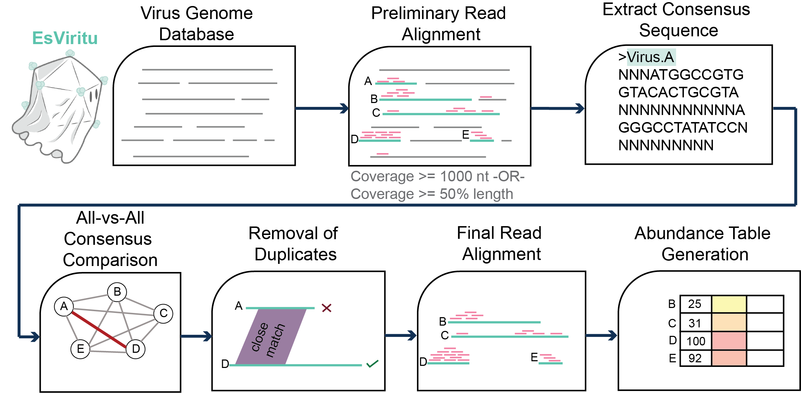
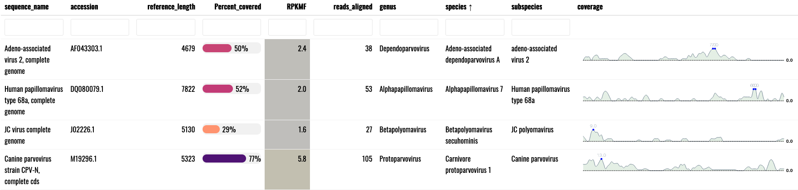

# EsViritu

Read mapping pipeline for detection and measurement of human and animal virus pathogens from short read metagenomic environmental or clinical samples.

This approach is sensitive, specific, and ideal for exploring virus presence/absence/diversity within and between metagenomic or clinical samples. Interactive reports make it easy to see the breadth of read coverage for each detected virus. This tool should reliably detect virus genomes with 90% ANI or greater to reference genomes.


NOTE: The database used by `Esviritu` should cover all human and animal viruses in GenBank as of November 16th, 2022 (EsViritu DB v2.0.2). However, the genomes are dereplicated at 95% ANI so that only one genome from a nearly identical group is used. Please open an issue to report any omissions.

## Schematic



Logo by [Adrien Assie](https://github.com/aassie)


## Interactive report of detected viruses


## Threshold of detection

Virus genomes or segments are considered "detected" if: 

1)  at least 1000 nucletides of the reference genome/segment have coverage by 1 or more reads

**OR**

2)  at least 50% of the nucelotides of the reference genome/segment have coverage by 1 or more reads (relevant for references under 2 kb)

## Installation

**I have only tested this on Linux**

1)  Clone repo

`git clone https://github.com/cmmr/EsViritu.git`

2)  Go to `EsViritu` directory.

`cd EsViritu`

3)  use the file `environment/EsViritu.yml` with `conda create` to generate the environment used with this tool

`conda env create --file environment/EsViritu.yml`

4)  Activate the environment

`conda activate EsViritu`

5)  Install the `R` package `dataui` manually in an R session

`R`

then:

`remotes::install_github("timelyportfolio/dataui")`

6)  Download the database in the `Esviritu` directory (\~300 MB when decompressed).

`cd EsViritu`

`wget https://zenodo.org/record/7876309/files/DB_v2.0.2.tar.gz`

`md5sum DB_v2.0.2.tar.gz`

should return `8e207e6a9465d7e40e948d7559b014c4`

`tar -xvf DB_v2.0.2.tar.gz`

`rm DB_v2.0.2.tar.gz`

## (OPTIONAL) Database for filtering out host reads and spike-ins

You could filter unwanted sequences out upstream of this tool, but this will allow you to do it within `EsViritu` using `minimap2`. The pipeline script will look for a file at `filter_seqs/filter_seqs.fna` which could be any fasta-formatted sequence file you want to use to remove matching reads (e.g. from host or spike-in).

Here are instructions for downloading and formatting the human genome and phiX spike-in (3 GB decompressed).

```         
cd EsViritu
mkdir filter_seqs && cd filter_seqs

## download phiX genome and gunzip
wget https://ftp.ncbi.nlm.nih.gov/genomes/refseq/viral/Sinsheimervirus_phiX174/latest_assembly_versions/GCF_000819615.1_ViralProj14015/GCF_000819615.1_ViralProj14015_genomic.fna.gz
gunzip GCF_000819615.1_ViralProj14015_genomic.fna.gz

## download human genome and gunzip
wget https://ftp.ncbi.nlm.nih.gov/genomes/refseq/vertebrate_mammalian/Homo_sapiens/latest_assembly_versions/GCF_009914755.1_T2T-CHM13v2.0/GCF_009914755.1_T2T-CHM13v2.0_genomic.fna.gz
gunzip GCF_009914755.1_T2T-CHM13v2.0_genomic.fna.gz

## concatenate files
cat GCF_000819615.1_ViralProj14015_genomic.fna GCF_009914755.1_T2T-CHM13v2.0_genomic.fna > filter_seqs.fna

## optionally delete separate files
rm GCF_000819615.1_ViralProj14015_genomic.fna GCF_009914755.1_T2T-CHM13v2.0_genomic.fna
```

Remember to set `-f True` to run the filtering step.


## Step-by-step Description of Pipeline

-   inputs are .fastq files

1)  (OPTIONAL) Reads are filtered for quality and length, adapters are removed, then reads mapping to human genome or phiX spike in are removed. Must set flags `-q True -f True`.
2)  Filtered reads are aligned to a dereplicated database of human and animal virus genomes/segments. (read alignment: \>= 90% ANI and \>= 90% read coverage)
3)  Consensus sequences of each detected reference genome/segment are determined, then all consensus sequences are compared pair-wise to detect and dereplicate near-identical sequences.
4)  The reads from the original alignment are re-aligned to the dereplicated references.
5)  Consensus sequences are determined for each detected dereplicated genome/segment. `*.final.consensus.with_NNs.fasta`
6)  breadth, depth, and abundance of read coverage is determined for each detected genome/segment.
7)  Percent identity is calculated between each consensus and it's reference. `*consensus_to_refence.tsv`
8)  With this information and taxonomical data on each reference, a summary table `*.threshold.info.tsv` and a reactable (interactive table) with a visualization of read coverage `*.reactable.html` is generated.


# Running the tool

**I have only tested this on Linux and I doubt it would work on MacOS or Windows**

You might run this as part of a bash script, do your own upstream read processing, etc, but these are the basic instructions.

*Required inputs:*

`-r reads file (.fastq)`

`-s sample name`

`-t # of threads`

`-o output directory (may be shared with other samples)`

Activate the conda environment:

`conda activate EsViritu`

Individual samples can be run with the python script. E.g.:

**Basic run with 1 .fastq file:**

```         
python /path/to/EsViritu/src/run_EsViritu.py -r /path/to/reads/myreads.fastq -s sample_ABC -t 16 -o myproject_EsViritu_general1
```

**Using multiple input .fastq files (also, see paired end input below)**

```         
python /path/to/EsViritu/src/run_EsViritu.py -r /path/to/reads/myreads1.fastq /path/to/reads/myreads2.fastq /path/to/reads/myreads3.fastq -s sample_ABC -t 16 -o myproject_EsViritu_general1
```

**Using paired end input .fastq files. Must be exactly 2 files.**

```         
python /path/to/EsViritu/src/run_EsViritu.py -r /path/to/reads/myreads.R1.fastq /path/to/reads/myreads.R2.fastq -s sample_ABC -t 16 -o myproject_EsViritu_general1 -p paired
```

**With pre-filtering steps:**

```         
python /path/to/EsViritu/src/run_EsViritu.py -r /path/to/reads/myreads.fastq -s sample_ABC -t 16 -o myproject_EsViritu_general1 -q True -f True
```

**Help menu**

```         
python /path/to/EsViritu/src/run_EsViritu.py -h
```

## Make a Summary for Batch of Reports

Run the batch summary bash script with the following arguments:

1)  Directory containing the output files (`*.threshold.info.tsv` & `*.mean_cov.tsv` for each sample)
2)  Name/stem for output files

Example:

Activate conda environment: `conda activate EsViritu`

Then:
```         
bash /path/to/EsViritu/src/make_summary_batch_of_samples1.sh myproject_EsViritu_general1 myproject_report_out
```

This command will generate the table `myproject_report_out.coverm.combined.tax.tsv` and the reactable `myproject_report_out.batch_detected_viruses.html` both of which summarize information about all the samples in the given directory.

# Limitations and Considerations

Because this tool is based on mapping to reference genomes, recombination and reassortment can cause some issues. 

For example, strains of picornaviruses naturally recombine with other strains. So, if the virus genome in your sample is a recombinant between the 5' half of "Picornavirus Strain A" and the 3' half of "Picornavirus Strain B", the output from `Esviritu` will indicate that you have both "Picornavirus Strain A" and "Picornavirus Strain B" in your sample. In these cases, it's useful to look at the html reports to analyze coverage across the genome(s).

Primarily, we have tested this tool on samples enriched for viruses using hybrid-probe capture (e.g. TWIST Comprehensive Virus Research Panel) because most samples, even those from clinical infections, have a low relative abundance of viral nucleic acid as compared to nucleic acids from host or other microbes. However, we expect that this tool will work with bulk WGS or RNA-seq when a handful of reads from a virus genome are present in a .fastq file.

RPKMF, the abundance metric used in `EsViritu` is:

`(Reads Per Kilobase of reference genome)/(Million reads passing Filtering)`


For the file `*consensus_seqs_vs_ref_seqs.tsv`, expect `percent_ANI` to be a bit low, as `samtools consensus` (used to generate consensus sequences) is used with conservative settings, so a relatively high number of "N"s may be encoded in the consensus sequence.

# Citation

Comprehensive Wastewater Sequencing Reveals Community and Variant Dynamics of the Collective Human Virome

Michael Tisza, Sara Javornik Cregeen, Vasanthi Avadhanula, Ping Zhang, Tulin Ayvaz, Karen Feliz, Kristi L. Hoffman, Justin R. Clark, Austen Terwilliger, Matthew C. Ross, Juwan Cormier, David Henke, Catherine Troisi, Fuqing Wu, Janelle Rios, Jennifer Deegan, Blake Hansen, John Balliew, Anna Gitter, Kehe Zhang, Runze Li, Cici X. Bauer, Kristina D. Mena, Pedro A. Piedra, Joseph F. Petrosino, Eric Boerwinkle, Anthony W. Maresso

https://doi.org/10.1101/2023.05.03.23289441