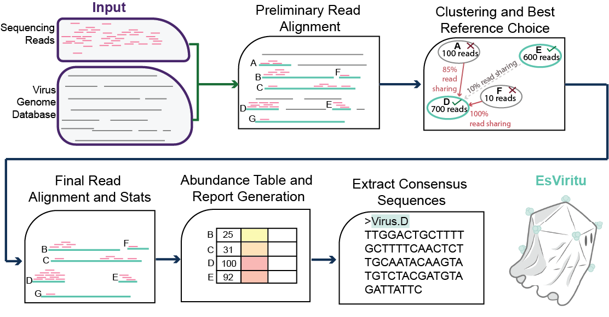
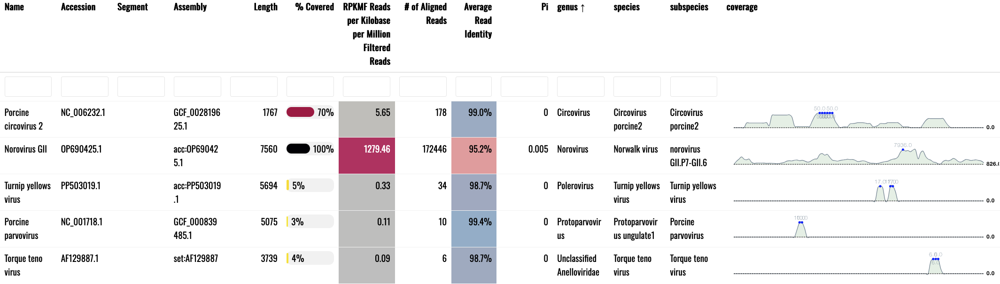
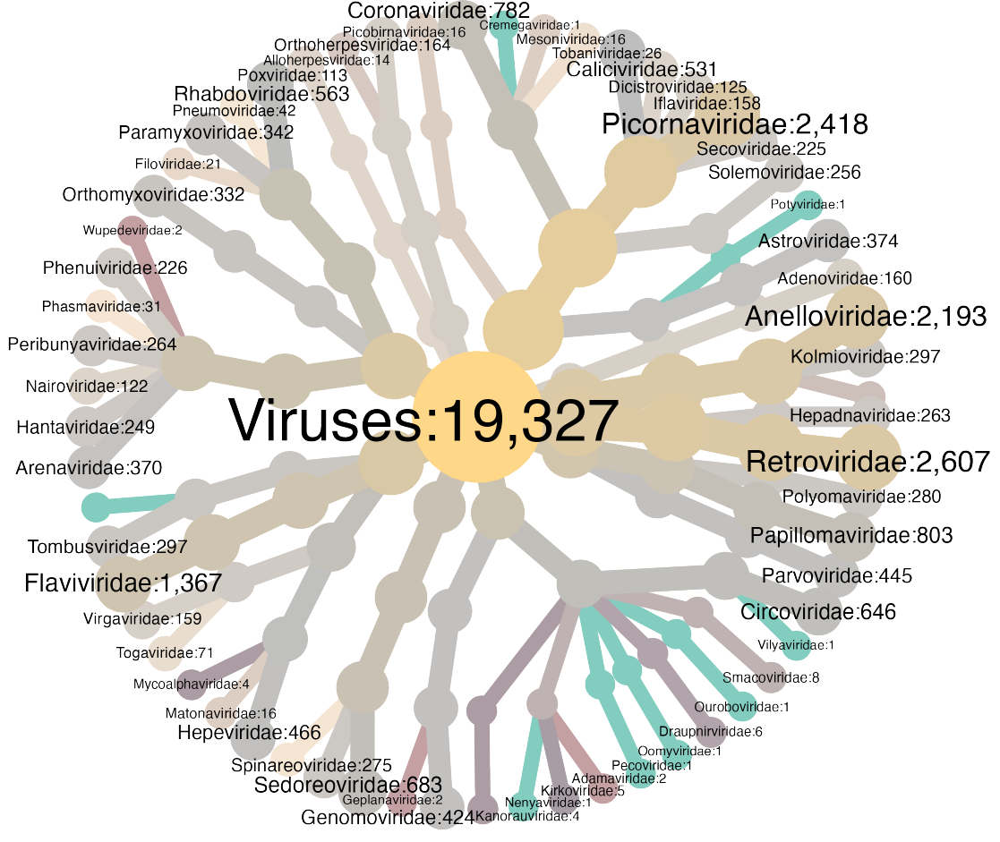

# EsViritu

[](https://anaconda.org/bioconda/esviritu) [](https://anaconda.org/bioconda/esviritu)

Read mapping pipeline for detection and measurement of human and animal virus pathogens from short read metagenomic environmental or clinical samples.

This approach is sensitive, specific, and ideal for exploring virus presence/absence/diversity within and between metagenomic or clinical samples. Interactive reports make it easy to see the breadth of read coverage for each detected virus. This tool should reliably detect virus genomes with 90% ANI or greater to reference genomes.

NOTE: The database used by `Esviritu` should cover all human and animal viruses in GenBank as of August 2025 (EsViritu DB v3.2.2). However, the genomes are dereplicated at 95% ANI so that only one genome from a nearly identical group is used. Please open an issue to report any omissions.

## Features

As of EsViritu `v1.0.0` (and later):

1) Highly curated sequence-to-taxonomy database of known human, animal, and plant viruses.

2) Single read sensitivity for detection (requires reads >= 100 nt).

3) Assembly-aware genome reconstructions for segmented viruses.

4) Expression of uncertainty (i.e. average read identity to reference, nucleotide diversity measurement).

5) Attractive HTML reports.

## Schematic




Logo by [Adrien Assie](https://github.com/aassie)


## Interactive report of detected viruses



## Viruses in Database

19,327 high quality virus genome assemblies across 44 taxonomic families:



## Installation

### Current Versions

Code: **v1.1.0**

Database: **v3.2.2**


### Stable release via Bionconda (recommended)

*NOTE: 2025-08-18 EsViritu v1.1.0 released and available on bioconda.*

**1)  Create conda environment. `mamba` is preferable to `conda` for environment creation.**

`mamba create -n EsViritu bioconda::esviritu`

**2)  Activate the environment with `conda`**

`conda activate EsViritu`

*you should be able to run help menu:*

`EsViritu -h`

**3)  Download the database (\~400 MB when decompressed). EsViritu v1.0.0 or higher requires DB v3.1.0 or higher!**

[](https://doi.org/10.5281/zenodo.16898905)

`cd` *where you want the database to reside*

`mkdir esviritu_DB && cd esviritu_DB`

Download the tarball of DB `v3.2.2` (most recent version) from Zenodo:

`wget https://zenodo.org/records/16898905/files/esviritu_db_v3.2.2.tar.gz`

Check that the download was successful:

`md5sum esviritu_db_v3.2.2.tar.gz`

should return `fb6850259b82d39dab104f4b9145f04d  esviritu_db_v3.2.2.tar.gz`

Unpack and remove the tarball:

`tar -xvf esviritu_db_v3.2.2.tar.gz`

`rm esviritu_db_v3.2.2.tar.gz`

DB files should be in `v3.2.2/`

**4)  Set the database path (optional but recommended):**

`conda env config vars set ESVIRITU_DB=/path/to/esviritu_DB/v3.2.2`

**5)  (OPTIONAL BUT RECOMMENDED) Install the `R` package `dataui` manually in an R session. Without `dataui` reports won't show genome coverage sparklines.**

`R`

then:

`remotes::install_github("timelyportfolio/dataui")`

### Developmental verision

<details>

  <summary>Detailed Instructions</summary>
  
  1)  Clone repo
  
  `git clone https://github.com/cmmr/EsViritu.git`
  
  2)  Go to `EsViritu` directory.
  
  `cd EsViritu`
  
  3)  use the file `environment/EsViritu.yml` with `mamba create` to generate the environment used with this tool
  
  `mamba env create --file environment/EsViritu.yml`
  
  4)  Activate the environment
  
  `conda activate EsViritu`
  
  5)  Make it command-line executable. From repo directory:
  
  `pip install .`
  
  *Now follow the database set up instructions above*

</details>

### Docker

<details>

  <summary>Basic Instructions</summary>
  
  **Please note that, while I WAS able to get this to run using `Docker`/`Docker Desktop` on my Mac, I am not a `Docker` expert, and I may be unable to troubleshoot issues.**
  
  1)  Pull Docker image (v1.1.0 shown below)
  
  `docker pull quay.io/biocontainers/esviritu:1.1.0--pyhdfd78af_0`
  
  *Notes:* 
  
    * be sure to mount your volumes/directories with the `EsViritu` database as well as those with input read files 
    
    * I believe you can save environmental variables like ESVIRITU_DB in `Docker` containers

</details>

## (OPTIONAL) Database for filtering out host reads and spike-ins

You could filter unwanted sequences out upstream of this tool, but this will allow you to do it within `EsViritu` using `minimap2`. The pipeline script will look for a file at `filter_seqs/filter_seqs.fna` which could be any fasta-formatted sequence file you want to use to remove matching reads (e.g. from host or spike-in).

Here are instructions for downloading and formatting the human genome and phiX spike-in (3 GB decompressed).

**NOTE: When analyzing sequences from human tissues processed via hybrid capture virome sequencing, quantification may be more accurate if human reads are NOT removed**

```
cd EsViritu ### or `cd` where you want the filter_seqs to reside
mkdir filter_seqs && cd filter_seqs

## download phiX genome and gunzip
wget https://ftp.ncbi.nlm.nih.gov/genomes/refseq/viral/Sinsheimervirus_phiX174/latest_assembly_versions/GCF_000819615.1_ViralProj14015/GCF_000819615.1_ViralProj14015_genomic.fna.gz
gunzip GCF_000819615.1_ViralProj14015_genomic.fna.gz

## download human genome and gunzip
wget https://ftp.ncbi.nlm.nih.gov/genomes/refseq/vertebrate_mammalian/Homo_sapiens/latest_assembly_versions/GCF_009914755.1_T2T-CHM13v2.0/GCF_009914755.1_T2T-CHM13v2.0_genomic.fna.gz
gunzip GCF_009914755.1_T2T-CHM13v2.0_genomic.fna.gz

## concatenate files
cat GCF_000819615.1_ViralProj14015_genomic.fna GCF_009914755.1_T2T-CHM13v2.0_genomic.fna > filter_seqs.fna

## optionally delete separate files
rm GCF_000819615.1_ViralProj14015_genomic.fna GCF_009914755.1_T2T-CHM13v2.0_genomic.fna

## set the filter_seqs directory as an environmental variable
conda env config vars set ESVIRITU_FILTER=/path/to/filter_seqs
```

Remember to set `-f True` to run the filtering step.

## Step-by-step Description of Pipeline

-   inputs are .fastq files

1)  (OPTIONAL) Reads are filtered for quality and length, adapters are removed, then reads mapping to human genome or phiX spike in are removed. Must set flags `-q True -f True`.
2)  Filtered reads are aligned to a dereplicated database of human, animal, and plant virus genomes/segments. (read alignment: \>= 80% ANI, \>= 100 nt aligned, and \>= 90% read coverage)
3)  Candidate reference genomes are dereplicated. First, a network of references (binned at the assembly level) sharing \>= 33% of reads aligned (union of read IDs) is generated. Then, local maxima references are determined by total reads aligned. Read ANI is calculated to break ties if two references have identical count of reads aligned. These references are carried forward for final quantification.
4)  The reads from the original alignment are re-aligned to the dereplicated references.
5)  breadth, depth, abundance, average read identity, and nucleotide diversity (Pi) is determined for each detected genome/segment.
6)  Summary tables are generated for the contig level `*.detected_virus.info.tsv` and the assembly level `*.detected_virus.assembly_summary.tsv`
7)  Consensus sequences are determined for each detected dereplicated genome/segment. `*_final_consensus.fasta`
8)  A reactable (interactive table) with a visualization of read coverage profile `*.reactable.html` is generated.

# Running the tool


You might run this as part of a bash script, snakemake pipeline, do your own upstream read processing, etc, but these are the basic instructions.

*Required inputs:*

`-r reads file (.fastq)`

`-s sample name`

`-o output directory (may be shared with other samples)`

Activate the conda environment:

`conda activate EsViritu`

Individual samples can be run with the python script. E.g.:

**Basic run with 1 .fastq file:**

```bash
EsViritu -r /path/to/reads/myreads.fastq -s sample_ABC -o myproject_EsViritu1 -p unpaired
```

**Using paired end input .fastq files. Must be exactly 2 files.**

```bash
EsViritu -r /path/to/reads/myreads.R1.fastq /path/to/reads/myreads.R2.fastq -s sample_ABC -o myproject_EsViritu1 -p paired
```

**With pre-filtering steps:**

```bash
EsViritu -r /path/to/reads/myreads.fastq -s sample_ABC -o myproject_EsViritu1 -q True -f True -p unpaired
```

**Help menu**

```         
EsViritu -h
```

## Make a Summary for Batch of Reports

Run the batch summary script to collate reports from several sequencing libraries in a project:

Example:

Activate conda environment: `conda activate EsViritu`

Then run the `summarize_esv_runs` command with the relative path to the output directory as the only argument:

```bash
summarize_esv_runs myproject_EsViritu1
```

This command will generate the tables `myproject_EsViritu1.detected_virus.info.tsv`, `myproject_EsViritu1.detected_virus.assembly_summary.tsv` and the reactable `myproject_EsViritu1.batch_detected_viruses.html`, which summarize information about all the samples in the given directory.

# Limitations and Considerations

Because this tool is based on mapping to reference genomes, recombination and reassortment can cause some issues.

For example, strains of picornaviruses naturally recombine with other strains. So, if the virus genome in your sample is a recombinant between the 5' half of "Picornavirus Strain A" and the 3' half of "Picornavirus Strain B", the output from `Esviritu` will indicate that you have both "Picornavirus Strain A" and "Picornavirus Strain B" in your sample. In these cases, it's useful to look at the html reports to analyze coverage across the genome(s). Based on our testing, this only happens with recombinant viruses that have no records in GenBank.

RPKMF, the abundance metric used in `EsViritu` is:

`(Reads Per Kilobase of reference genome)/(Million reads passing Filtering)`

From `v0.2.3` to `v1.0.0` the tool, while having the same goal, has undergone very extensive code refactoring, logic, and database updates. These include:
- The database is completely redone and increased in size by ~2.5X.
  - Subspecies taxonomy labels are added (not in GenBank records) for SARS-CoV-2, Norovirus, Mpox, Rotavirus.
  - Segmented virus genomes are treated as coherent assemblies by the tool rather than unaffiliated contigs.
  - Genbank records that appeared incomplete based on length and/or number of segments were removed.
  - Genbank records with sequences highly similar to human genomic DNA, vectors, or other common contaminants were removed.
  - Genbank records without complete taxonomy information (e.g. a virus called picornaviridae sp. lacks genus and species labels) were excluded.
- All code (other than the .hmtl report) is rewritten in python, making it more robust and reducing dependencies.
- Read ANI and nucleotide diversity (Pi) calculations are now reported.


# Citation

Wastewater sequencing reveals community and variant dynamics of the collective human virome


Michael Tisza, Sara Javornik Cregeen, Vasanthi Avadhanula, Ping Zhang, Tulin Ayvaz, Karen Feliz, Kristi L. Hoffman, Justin R. Clark, Austen Terwilliger, Matthew C. Ross, Juwan Cormier, David Henke, Catherine Troisi, Fuqing Wu, Janelle Rios, Jennifer Deegan, Blake Hansen, John Balliew, Anna Gitter, Kehe Zhang, Runze Li, Cici X. Bauer, Kristina D. Mena, Pedro A. Piedra, Joseph F. Petrosino, Eric Boerwinkle, Anthony W. Maresso

<https://doi.org/10.1038/s41467-023-42064-1>
