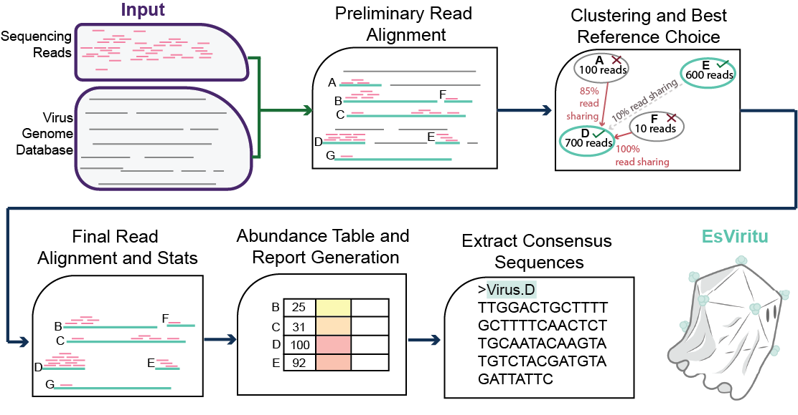
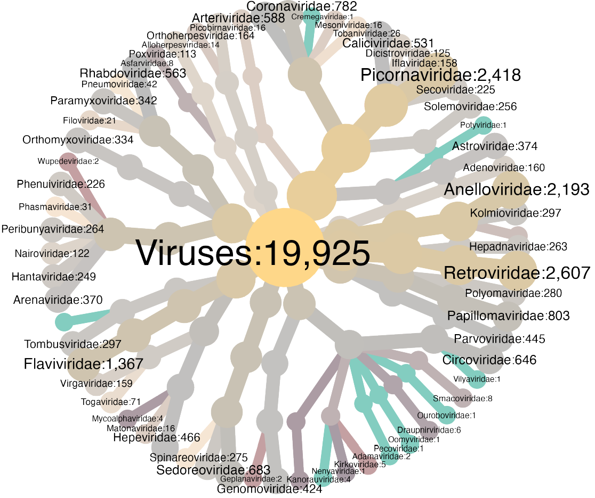

# EsViritu

[](https://anaconda.org/bioconda/esviritu) [](https://anaconda.org/bioconda/esviritu)

Read mapping pipeline for detection and measurement of human and animal virus pathogens from short read metagenomic environmental or clinical samples.

This approach is sensitive, specific, and ideal for exploring virus presence/absence/diversity within and between metagenomic or clinical samples. Interactive reports make it easy to see the breadth of read coverage for each detected virus. This tool should reliably detect virus reads with 80% ANI or greater to reference genomes.

See documentation and manual on the dedicated ReadTheDocs [site](https://esviritu.readthedocs.io/en/latest/)
## Features

As of EsViritu `v1.0.0` (and later):

1) Highly curated sequence-to-taxonomy database of known human, animal, and plant viruses.

2) Single read sensitivity for detection (requires reads >= 100 nt).

3) Assembly-aware genome reconstructions for segmented and non-segmented viruses.

4) Expression of uncertainty (i.e. average read identity to reference, nucleotide diversity measurement).

5) Attractive HTML reports.

## Schematic




Logo by [Adrien Assie](https://github.com/aassie)


## Interactive report of detected viruses


## Viruses in Database

19,925 high quality virus genome assemblies across 63 taxonomic families:



## Installation

### Current Versions

Code: **v1.1.3**

Database: **v3.2.4**


### Stable release via Bioconda (recommended)

*NOTE: 2025-11-25 EsViritu v1.1.2 released and available on bioconda.*

**1)  Create conda environment. `mamba` is preferable to `conda` for environment creation.**

`mamba create -n EsViritu bioconda::esviritu`

**2)  Activate the environment with `conda`**

`conda activate EsViritu`

*you should be able to run help menu:*

`EsViritu -h`

**3)  Download the database (\~400 MB when decompressed). EsViritu v1.0.0 or higher requires DB v3.1.0 or higher!**

[](https://doi.org/10.5281/zenodo.17716199)


`cd` *where you want the database to reside*

`mkdir esviritu_DB && cd esviritu_DB`

Download the tarball of DB `v3.2.4` (most recent version) from Zenodo:

`wget https://zenodo.org/records/17716199/files/esviritu_db_v3.2.4.tar.gz`

Check that the download was successful:

`md5sum esviritu_db_v3.2.4.tar.gz`

should return `24d85c1ec3cbffff12e921d2f39c91b2  esviritu_db_v3.2.4.tar.gz`

Unpack and remove the tarball:

`tar -xvf esviritu_db_v3.2.4.tar.gz`

`rm esviritu_db_v3.2.4.tar.gz`

DB files should be in `v3.2.4/`

**4)  Set the database path (optional but recommended):**

`conda env config vars set ESVIRITU_DB=/path/to/esviritu_DB/v3.2.4`

**5)  (OPTIONAL BUT RECOMMENDED) Install the `R` package `dataui` manually in an R session. Without `dataui` reports won't show genome coverage sparklines.**

`R`

then:

`remotes::install_github("timelyportfolio/dataui")`

**See development and container installation guides in the [documentation](https://esviritu.readthedocs.io/en/latest/).

# Running the tool

You might run this as part of a bash script, snakemake pipeline, do your own upstream read processing, etc, but these are the basic instructions.

*Required inputs:*

`-r reads file (.fastq)`

`-s sample name`

`-o output directory (may be shared with other samples)`

Activate the conda environment:

`conda activate EsViritu`

Individual samples can be run with the python script. E.g.:

**Basic run with 1 .fastq file:**

```bash
EsViritu -r /path/to/reads/myreads.fastq -s sample_ABC -o myproject_EsViritu1 -p unpaired
```

**Using paired end input .fastq files. Must be exactly 2 files.**

```bash
EsViritu -r /path/to/reads/myreads.R1.fastq /path/to/reads/myreads.R2.fastq -s sample_ABC -o myproject_EsViritu1 -p paired
```

**With pre-filtering steps:**

```bash
EsViritu -r /path/to/reads/myreads.fastq -s sample_ABC -o myproject_EsViritu1 -q True -f True -p unpaired
```

**Help menu**

```         
EsViritu -h
```

## Make a Summary for Batch of Reports

Run the batch summary script to collate reports from several sequencing libraries in a project:

Example:

Activate conda environment: `conda activate EsViritu`

Then run the `summarize_esv_runs` command with the relative path to the output directory as the only argument:

```bash
summarize_esv_runs myproject_EsViritu1
```

This command will generate the tables `myproject_EsViritu1.detected_virus.info.tsv`, `myproject_EsViritu1.detected_virus.assembly_summary.tsv`, `myproject_EsViritu1.tax_profile.tsv` and the reactable `myproject_EsViritu1.batch_detected_viruses.html`, which summarize information about all the samples in the given directory.

# Citation

Wastewater sequencing reveals community and variant dynamics of the collective human virome


Michael Tisza, Sara Javornik Cregeen, Vasanthi Avadhanula, Ping Zhang, Tulin Ayvaz, Karen Feliz, Kristi L. Hoffman, Justin R. Clark, Austen Terwilliger, Matthew C. Ross, Juwan Cormier, David Henke, Catherine Troisi, Fuqing Wu, Janelle Rios, Jennifer Deegan, Blake Hansen, John Balliew, Anna Gitter, Kehe Zhang, Runze Li, Cici X. Bauer, Kristina D. Mena, Pedro A. Piedra, Joseph F. Petrosino, Eric Boerwinkle, Anthony W. Maresso

<https://doi.org/10.1038/s41467-023-42064-1>
