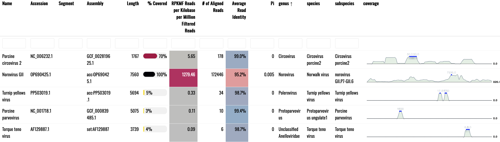

# Limitations and Considerations

## Undocumented recombinants
Because this tool is based on mapping to reference genomes, recombination and reassortment can cause some issues.

For example, strains of picornaviruses naturally recombine with other strains. So, if the virus genome in your sample is a recombinant between the 5' half of "Picornavirus Strain A" and the 3' half of "Picornavirus Strain B", the output from `Esviritu` will indicate that you have both "Picornavirus Strain A" and "Picornavirus Strain B" in your sample. In these cases, it's useful to look at the html reports to analyze coverage across the genome(s). Based on our testing, this only happens with recombinant viruses that have no records in GenBank (or our database).

## Abundance metric
RPKMF, the abundance metric used in `EsViritu` is:

`(Reads Per Kilobase of reference genome)/(Million reads passing Filtering)`

## Read ANI as guide to interpreting results
EsViritu, by design, finds the "best" reference genomes (assemblies) in its database for each sample. This is based on number of reads aligned and average read ANI (average nucleotide identity) compared to similar genomes. The EsViritu output will report on each "best" reference, including its sample-specific alignment stats (read ANI and Pi) as well as its static metadata such as Length and taxonomic data to the subspecies level. 

Sometimes, reads align to a reference with low read ANI, e.g. 88% ANI. This suggests that a virus somewhat different than the reference is present in the sample. EsViritu does not have a *de facto* threshold to determine if the results support the presence of a known subspecies or species. The reason for this is the inconsistency of how different sub-fields of virology delineate different taxonomic levels.

!!! Tip
    Users can set reasonable thresholds in downstream analysis, especially when having to analyze many samples.
    Here are some reasonable but non-definitive suggestions:

    - 95% ANI required to quantify aligned reads at subspecies level

    - 90% ANI required to quantify aligned reads at species level
 
## Example report screenshot
