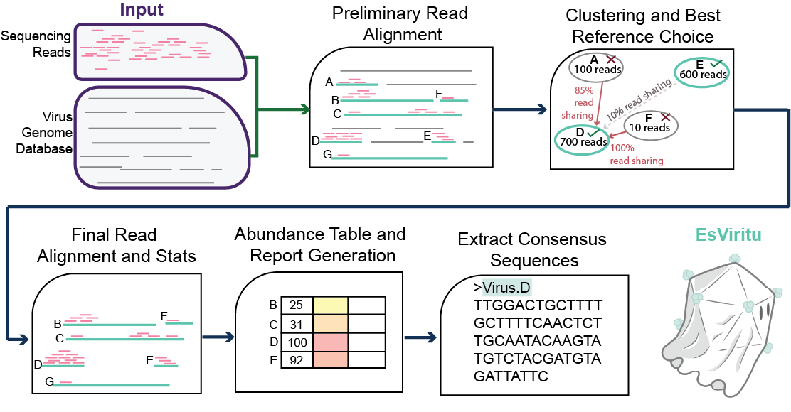

# Step-by-step Description of Pipeline

-   inputs are .fastq files

1)  (OPTIONAL) Reads are filtered for quality and length, adapters are removed, then reads mapping to human genome or phiX spike in are removed. Must set flags `-q True -f True`.

2)  Filtered reads are aligned to a dereplicated database of human, animal, and plant virus genomes/segments. (read alignment: \>= 80% ANI, \>= 100 nt aligned, and \>= 90% read coverage)

3)  Candidate reference genomes are dereplicated. First, a network of references (binned at the assembly level) sharing \>= 33% of reads aligned (union of read IDs) is generated. Then, local maxima references are determined by total reads aligned. Read ANI is calculated to break ties if two references have identical count of reads aligned. These references are carried forward for final quantification.

4)  The reads from the original alignment are re-aligned to the dereplicated references.

5)  breadth, depth, abundance, average read identity, and nucleotide diversity (Pi) is determined for each detected genome/segment.

6)  Summary tables are generated for the contig level `*.detected_virus.info.tsv` and the assembly level `*.detected_virus.assembly_summary.tsv`

7)  Consensus sequences are determined for each detected dereplicated genome/segment. `*_final_consensus.fasta`

8)  A reactable (interactive table) with a visualization of read coverage profile `*.reactable.html` is generated.

# Schematic

